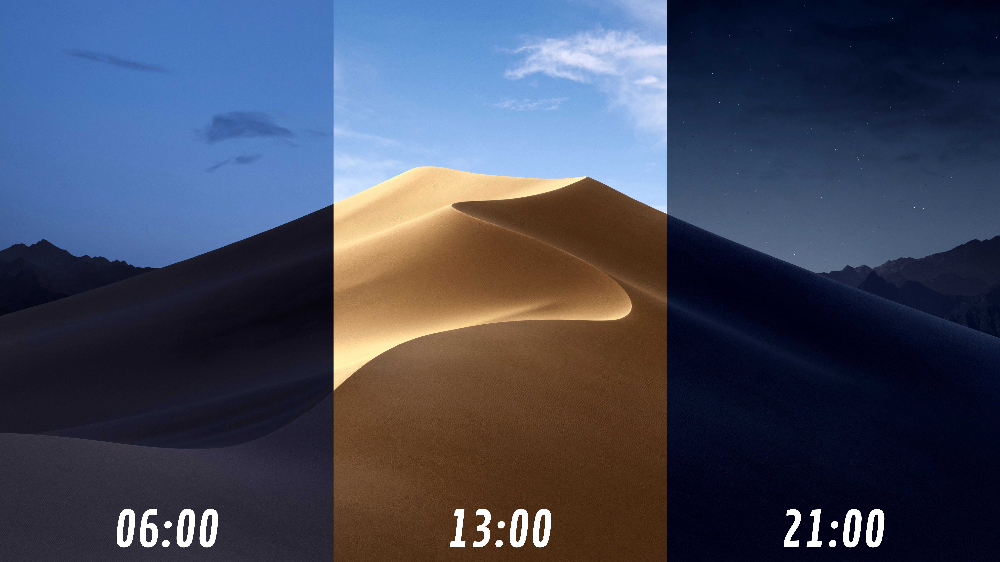

# Description
* This application changes the background image according to the time for xfce desktop environments.

# Note
* Changing the system clock manually does not trigger a background change.
* You can replace the pictures in the "src/backgrounds" folder with your own images and reload them. (Without changing the names!)
* The names of the images in the "src/backgrounds" folder represent the hours (Example: 6.jpg ------ 06:00)

# Screenshot
<p align="center">
	
</p>

# Install as user
```
$ git clone https://github.com/05akalan57/xfce-dynamic-wallpaper.git
```
```
$ cd xfce-dynamic-wallpaper/
```
```
$ ./INSTALL_USER.sh
```

### After installation, please restart the computer !!